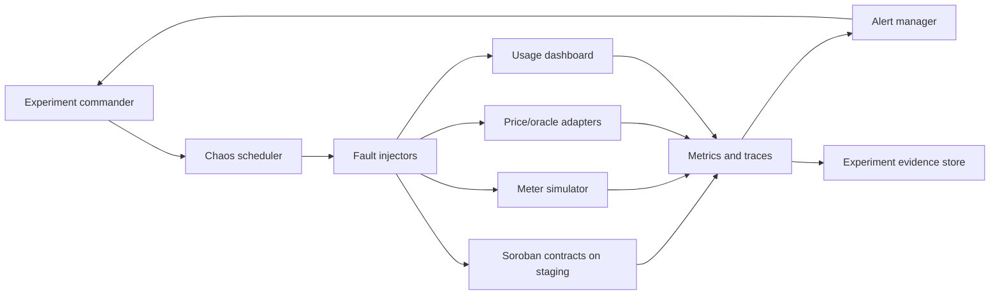

# Chaos Engineering Testing Blueprint for Staging

**Environment:** Staging only  
**Status:** Required before production chaos experiments  
**Performance SLO:** Critical contract and simulator paths must remain below 100 ms P99 during steady-state and recover below 100 ms P99 after each experiment.  
**Availability SLO:** Staging services must maintain 99.99% monthly availability outside approved experiment windows.  
**Security gate:** Every experiment plan must pass security review before execution.

## 1. Goals and guardrails

Chaos testing validates that the Utility Protocol can tolerate realistic service, network, oracle, simulator, dashboard, and contract-adapter failures without silently violating billing, settlement, or safety invariants.

The staging program has four goals:

1. Prove that critical paths recover to the performance SLO after injected faults.
2. Confirm that emergency controls, pauses, velocity limits, oracle fallbacks, and runbooks are actionable.
3. Verify observability by requiring alerts, dashboard panels, and incident notes for every experiment.
4. Exercise blue-green and canary deployment procedures before any production rollout.

Non-negotiable guardrails:

- Never run destructive chaos experiments against mainnet or production identities.
- Use staging-only signing keys, meters, dashboards, and notification channels.
- Keep a named experiment commander, communications lead, and rollback approver online for every run.
- Stop immediately if customer-like balances, settlement accounting, or admin authorization checks diverge from expected values.
- Preserve logs, traces, contract invocation IDs, and dashboard screenshots for the post-experiment review.

## 2. Architecture



### Components

| Component | Responsibility | Required controls |
|---|---|---|
| Experiment commander | Owns go/no-go, abort, and rollback decisions | On-call for entire run |
| Chaos scheduler | Starts and stops approved experiments | Allowlist of experiment IDs and time windows |
| Fault injectors | Inject latency, process restarts, network loss, stale oracle data, simulator clock drift, and dashboard API failures | Staging namespace and identity isolation |
| Metrics and traces | Capture latency, error rate, availability, invariant checks, ledger submission outcomes, and alert health | Retention for at least 30 days |
| Alert manager | Pages staging responders when thresholds breach | Dedicated staging routing keys |
| Evidence store | Stores plans, approvals, screenshots, logs, and review notes | Immutable experiment folder per run |

## 3. Experiment lifecycle

1. **Design** — Write the hypothesis, blast radius, services affected, expected alerts, SLO thresholds, abort criteria, and rollback steps.
2. **Security review** — Confirm the experiment cannot reach production keys, production network endpoints, real funds, or unapproved customer data.
3. **Readiness check** — Confirm staging green status, dashboards loading, alert routes tested, and rollback owner online.
4. **Blue-green deploy** — Deploy the chaos-enabled configuration to the green staging slice while blue remains stable.
5. **Canary analysis** — Route 5% of staging simulator traffic to green for 15 minutes and compare P99 latency, error rate, and invariant checks.
6. **Experiment execution** — Run one fault at a time unless an approved scenario explicitly requires compound failures.
7. **Abort or recover** — Stop the experiment if any abort threshold triggers; otherwise allow automated recovery to complete.
8. **Review** — Record outcome, timeline, metrics, alert quality, runbook gaps, and follow-up issues.

## 4. Initial experiment catalog

| ID | Scenario | Fault injection | Expected behavior | Abort criteria |
|---|---|---|---|---|
| CE-STG-001 | Meter simulator network partition | Drop outbound simulator traffic to contract adapter for 5 minutes | Backoff retries occur; no duplicate billing events are accepted | Duplicate settled usage, critical P99 > 100 ms for 10 minutes after recovery, or error rate > 5% |
| CE-STG-002 | Stale oracle data | Freeze oracle adapter responses at an old timestamp | Freshness checks reject stale price data and surface alerts | Any stale price accepted for settlement |
| CE-STG-003 | Contract adapter latency | Add 250 ms artificial adapter latency for 10 minutes | Dashboard degrades gracefully; contract calls remain bounded by retry budget | Retry storm, queue depth rising for 5 consecutive minutes, or critical P99 fails recovery SLO |
| CE-STG-004 | Dashboard API failure | Return HTTP 503 from usage API for 3 minutes | UI shows degraded state and alert fires without affecting contract state | Blank dashboard, unhandled client exception, or missing alert |
| CE-STG-005 | Settlement worker restart | Restart staging settlement worker during active simulator traffic | Idempotency prevents double settlement and resumes from last checkpoint | Replayed settlement, missed checkpoint, or manual data repair required |
| CE-STG-006 | Emergency pause drill | Trigger staging-only pause flow for selected meters | Claims and deductions halt; operator can verify and unpause according to runbook | Unauthorized caller succeeds or authorized pause fails |

## 5. Core validation logic

Each experiment must publish machine-readable results with this minimum schema:

```json
{
  "experiment_id": "CE-STG-001",
  "started_at": "2026-07-17T00:00:00Z",
  "ended_at": "2026-07-17T00:05:00Z",
  "hypothesis_passed": true,
  "critical_p99_ms": 87,
  "availability_percent": 99.995,
  "alerts_fired": ["staging-meter-partition"],
  "invariant_failures": [],
  "rollback_required": false
}
```

Automated checks must fail the experiment when any of the following occurs:

- Critical-path P99 is greater than 100 ms for more than 10 minutes after recovery.
- Staging availability outside the approved experiment window drops below 99.99% monthly-equivalent availability.
- A security control, authorization requirement, nonce check, or replay protection check fails.
- Billing, streaming, settlement, or oracle freshness invariants fail.
- Required alerts or dashboards do not show the injected failure.

## 6. Monitoring, alerting, and dashboards

Create or update staging dashboards with these panels before enabling recurring chaos runs:

- Critical-path P50/P95/P99 latency by service and contract operation.
- Availability and error budget burn for staging services.
- Contract invocation success, failure, and retry counts.
- Meter simulator publish rate, retry count, duplicate event count, and clock drift.
- Oracle freshness age, last successful update, and rejected stale submissions.
- Settlement queue depth, checkpoint age, idempotency replays, and failed settlements.
- Emergency pause state, challenge count, and recovery duration.
- Alert delivery latency and notification success rate.

Alert thresholds:

| Alert | Threshold | Severity |
|---|---|---|
| `CriticalPathP99High` | P99 > 100 ms for 5 minutes outside injection window | Page |
| `StagingAvailabilityBurn` | 2% monthly error budget consumed in 1 hour | Page |
| `OracleFreshnessViolation` | Stale oracle data accepted or freshness age beyond configured limit | Page |
| `DuplicateSettlementDetected` | Any duplicate settlement invariant failure | Page |
| `ChaosExperimentMissingAlert` | Expected alert absent 2 minutes after injection | Ticket |
| `RecoveryTimeExceeded` | Recovery exceeds scenario-specific objective | Page |

## 7. Blue-green and canary rollout

1. Keep the blue staging slice on the last known-good configuration.
2. Deploy chaos hooks, feature flags, and dashboards to green.
3. Run smoke tests against green using staging keys only.
4. Shift 5% of simulator traffic to green for 15 minutes.
5. Promote to 25%, then 50%, then 100% only if P99 latency, availability, error rate, and invariant checks remain within SLO.
6. Roll back to blue if any page-level alert fires, if an invariant fails, or if canary analysis reports statistically significant regression.

## 8. Runbook checklist

Before every experiment:

- [ ] Approved experiment plan is linked in the tracking issue.
- [ ] Security review is complete.
- [ ] Staging identities and endpoints are verified.
- [ ] Dashboards and alert routes are healthy.
- [ ] Rollback command and owner are documented.
- [ ] Experiment commander has announced start time and blast radius.

During every experiment:

- [ ] Announce injection start and stop timestamps.
- [ ] Watch P99 latency, availability, invariant checks, and expected alerts.
- [ ] Abort immediately when an abort criterion triggers.

After every experiment:

- [ ] Attach metrics, logs, traces, screenshots, and result JSON to the issue.
- [ ] Record whether the hypothesis passed.
- [ ] Create follow-up issues for missing telemetry, runbook gaps, failed alerts, or service defects.
- [ ] Confirm staging returned to baseline for 30 minutes.
